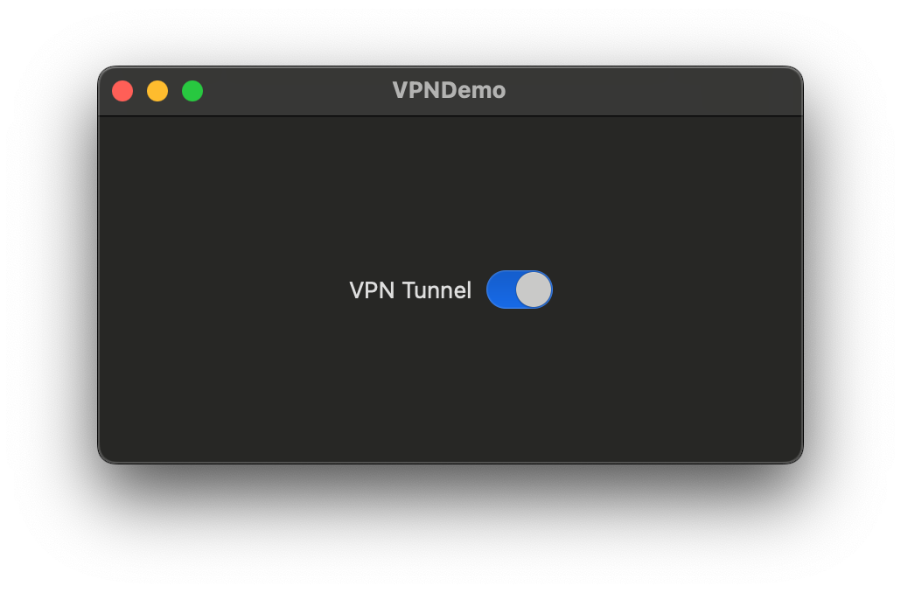
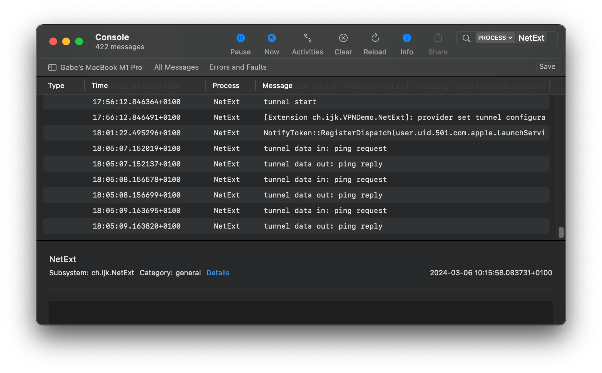

# VPNDemo

A macOS Network Extension for experimenting with VPN tunnels.

Network Extensions on macOS allow creating VPN tunnels without the need for kernel extensions or OS-level configurations. The extension is a process embedded in the app, recognised by the OS and executed automatically when the VPN tunnel is open. This process, running in user space, can handle the IP traffic routed into the tunnel.

This demo app contains such an extension. A simple button on the UI allows starting and stopping the extension, which creates and removes the tunnel.



Once started, the tunnel can be seen with the `ifconfig` command in the terminal:

```bash
$ ifconfig
...
utun4: flags=8051<UP,POINTOPOINT,RUNNING,MULTICAST> mtu 1500
	options=6460<TSO4,TSO6,CHANNEL_IO,PARTIAL_CSUM,ZEROINVERT_CSUM>
	inet 192.168.123.1 --> 192.168.123.1 netmask 0xffffffff
	nd6 options=201<PERFORMNUD,DAD>
```

The IP routing table is also visible in the terminal:

```bash
$ netstat -nr
...
192.168.123        link#25            UCS                 utun4
192.168.123.1      192.168.123.1      UH                  utun4
```

As you can see, any IP traffic sent to an IP address in the range from 192.168.123.0 to 192.168.123.255 is routed into the tunnel and can be handled by the Network Extension.

In a normal VPN, the extension should redirect the traffic to a remote destination. Here, the tunnel does nothing else than just replying to ping requests (ICMP echo requests).

In the terminal: 

```bash
$ ping 192.168.123.1
PING 192.168.123.1 (192.168.123.1): 56 data bytes
64 bytes from 192.168.123.1: icmp_seq=0 ttl=64 time=1.859 ms
64 bytes from 192.168.123.1: icmp_seq=1 ttl=64 time=1.037 ms
64 bytes from 192.168.123.1: icmp_seq=2 ttl=64 time=2.807 ms
...
```

The extension also logs few things that can be displayed in the Console app:



This is a very minimalistic demo, managing IPv4 ping only, but it demonstrates how a Network Extension can set a tunnel up, receive IP packets and send back packets to the OS.